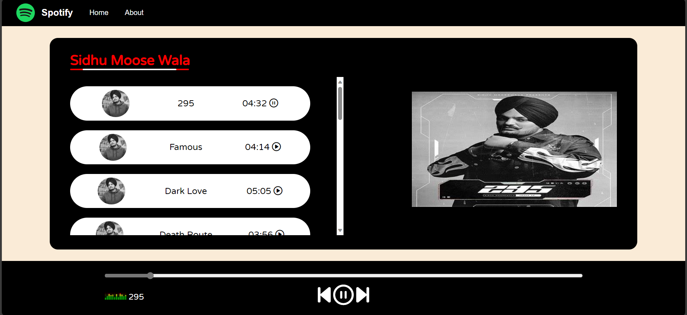

# Spotify Clone Project



## Introduction

Welcome to the Spotify Clone Project! This repository contains a responsive web application that replicates the iconic Spotify music streaming platform. Users can explore and enjoy a collection of songs, complete with playback controls and a seamless user experience.

## Features

- **Song Exploration**: Search for your favorite songs with ease.

- **Playback Controls**: Play, pause, skip, and adjust the volume of songs effortlessly.

- **Responsive Design**: Enjoy a consistent experience on all devices.

- **Queue Management**: Efficiently manage your song queue.

## Technologies Used

- **HTML5**: Used for structuring the content of the web application.

- **CSS3**: Applied for styling and beautifying the user interface.

- **JavaScript**: Empowering the dynamic functionality of the application.

## Demo

Check out the live demo [here](https://github.com/iMamoonAkhter/Spotify-Clone-Project) to experience the project in action.


## Installation

1. **Clone this Repository**: 
   ```sh
   git clone https://github.com/iMamoonAkhter/Spotify-Clone-Project.git
